# Guía de Configuración de Google Cloud
## I302 - Aprendizaje Automático y Aprendizaje Profundo | Universidad de San Andrés

Para desarrollar el proyecto final (PF) de la materia, les recomendamos configurar una instancia con GPU en Google Cloud Platform (GCP). Cada estudiante tendrá acceso a 1 cupón de 50 USD mediante el cual podrán utilizar tiempo de cómputo en la nube de Google Cloud. Es responsabilidad del estudiante utilizar dicho cupón correctamente, el cual debe ser utilizado exclusivamente para el desarrollo del PF. 

<table class="c55"><tr class="c41"><td class="c54" colspan="1" rowspan="1">🛑RECORDATORIO IMPORTANTE: ¡Asegurate de detener tu instancia!🛑

Sabemos que es probable que no leas hasta el final una vez que tu trabajo esté en ejecución, así que lo aclaramos al principio también porque es súper importante: 

✔️ No te olvides de detener tu instancia cuando termines (haciendo clic en el botón de detener en la parte superior de la página que muestra tus instancias). De lo contrario, se quedarán sin créditos... y sería una lástima 😥.

</td></tr></table>

-------------------------

Obtención de Créditos Académicos para Estudiantes
-----------------------------------------------------------------------------

1. Acceder al cupón usando este link: [Student Coupon Retrieval Link](https://vector.my.salesforce-sites.com/GCPEDU?cid=hkIn%2Bv1P6ZlLYSuKgALcBH0BHdRvHSm7W8Xde9W5%2BOrb03KwL%2B3OIvF3mNM3AWgF/).

1. Se va a solicitar nombre y mail de UdeSA.   
  Una vez que hayas verificado el mail, recibirás un mail con el código del cupón, detallando hasta cuándo es válido su uso y canje.

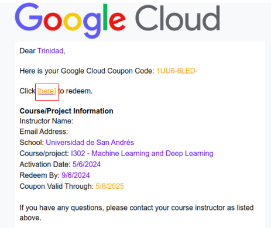

2. Canjear el cupón: Hacer clic en el link del mail recibido (Click \[here\] to redeem) para canjear el cupón. Esto abrirá la consola de GCP. Deberás completar con tu nombre y apellido, y el código de cupón que recibiste por mail (paso 1). Hacer clic en “Aceptar y Continuar”.  
  

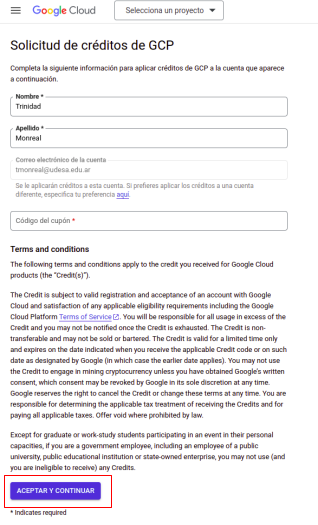

3. Asegúrate de tener los créditos: Abrir el menú de la izquierda ☰ &gt; Facturación.  
  

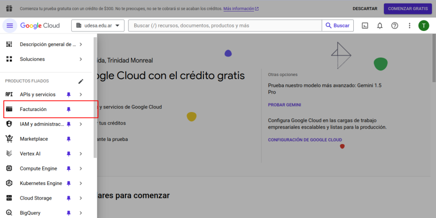

Luego seleccionar “Créditos” y se debería visualizar esta pantalla:

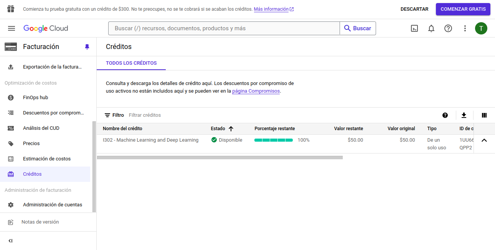

Para obtener información sobre cómo usar los cupones de todos los alumnos de un mismo grupo en un solo trabajo, pueden consultar [este link](https://www.google.com/url?q=https://services.google.com/fh/files/helpcenter/cloud_edu_billing_team_projects.pdf&sa=D&source=editors&ust=1718141758326487&usg=AOvVaw0OKS0ok-JiwDCI6mJBbw5a).

Configuración del Proyecto
----------------------------------------------------

1. Abrir el menú de la izquierda ☰ &gt; IAM y Administración &gt; Crea un proyecto.  
  

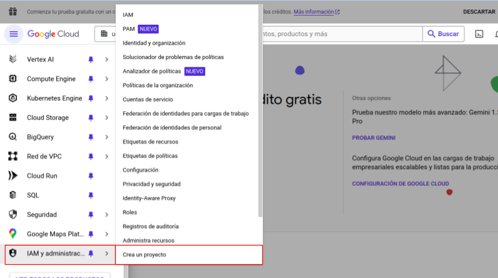

2. Asignarle un nombre al proyecto y hacer clic en “Crear”.

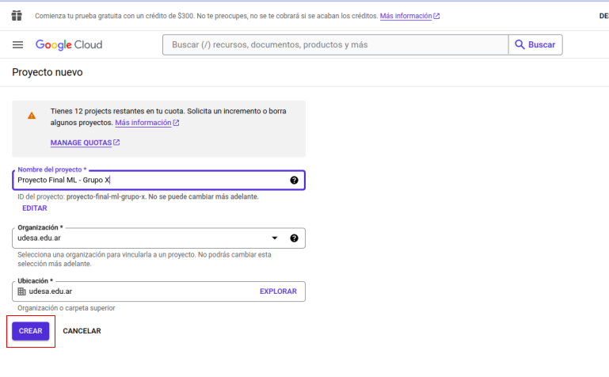

3. Una vez creado el proyecto, se abrirá el panel del mismo.   
  En caso de estar realizando el trabajo en grupo, acceder a la sección “Información del Proyecto” y hacer clic en “Agregar personas a este proyecto”.

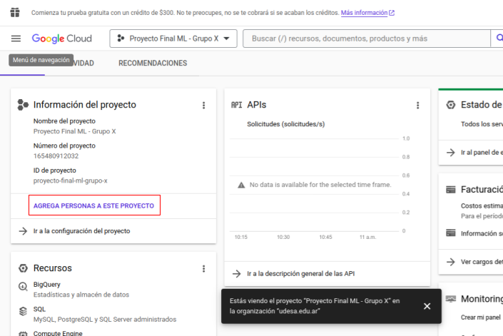

4. Ingresar el mail (@udesa.edu.ar) del compañero de grupo y asignar el rol de Propietario. Luego, guardar los cambios.

NOTA: Una vez que tengan asignado un Tutor, podrán agregarlo al proyecto de la misma manera.  

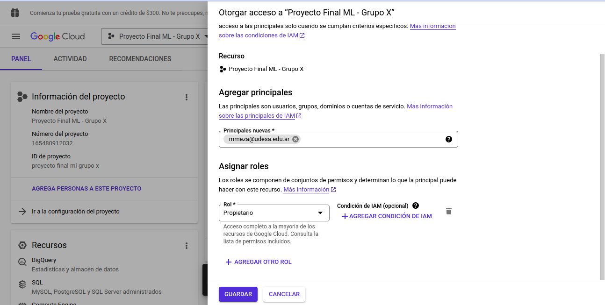

### Habilitar Compute Engine API y Solicitar Incremento en la Cuota de GPU

1. Abrir el menú de la izquierda ☰ &gt; Marketplace.  
  

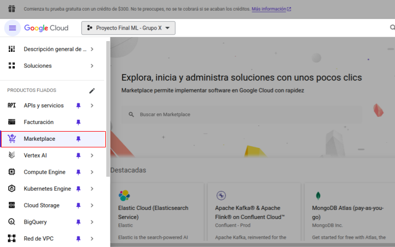

2. Buscar el producto “Compute Engine API”. Si no está habilitado, haga clic en “Habilitar”.

(Tengan paciencia, puede tardar unos minutos en habilitarse).  

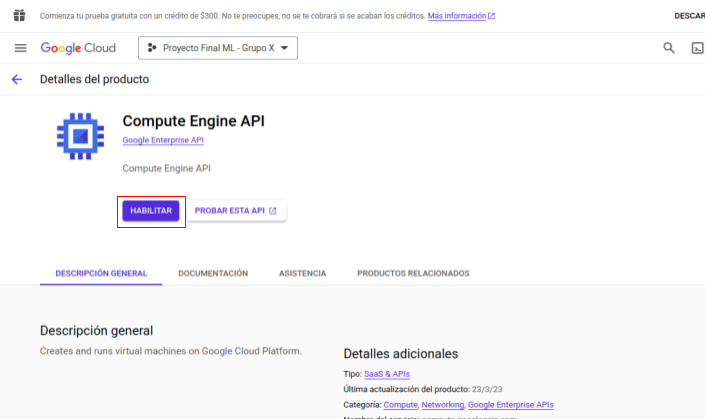

3. Abrir el menú de la izquierda ☰ &gt; IAM y Administración &gt; Cuotas y límites del sistema.
    En el filtro, seleccionar “Nombre del límite” desde el desplegable. Luego, seleccionar “GPUS-ALL-REGIONS-per-project”.

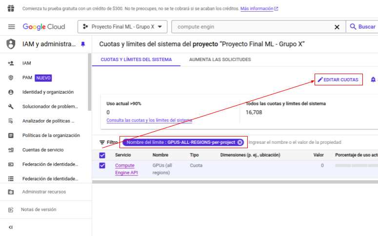

4. Tildar la caja de la izquierda de “Compute Engine API” y seleccionar “🖊️Editar cuotas”. 
5. En “Valor Nuevo”, ingresar 1.   
  En la “Descripción de la solicitud”, ingresar “Universidad de San Andrés I302 - Machine Learning and Deep Learning class project.”
  Presionar “Siguiente” y hacer clic en “Enviar Solicitud”. 

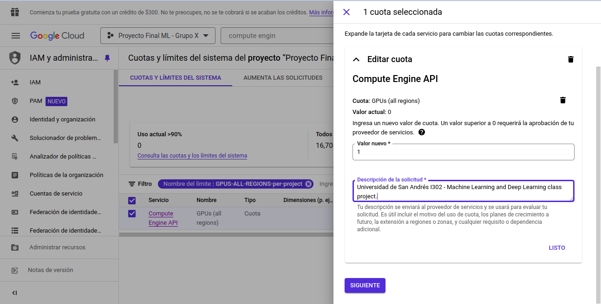

6. Luego de enviar la solicitud, recibirás un primer email confirmando la solicitud de cuota de GPUs. Debes esperar a recibir un segundo email de GCP que se ve como la siguiente imagen. La aprobación puede tardar desde un par de minutos hasta dos días hábiles.   
  

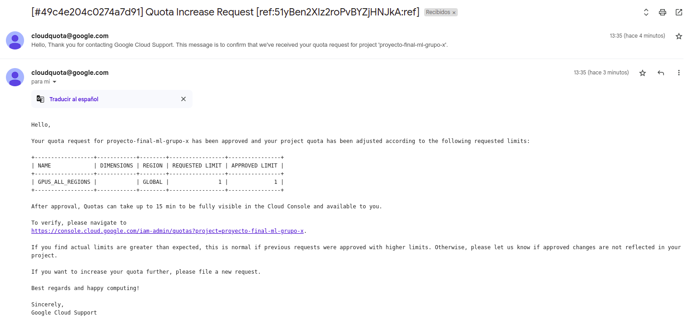

### 

### Configurar Deep Learning Virtual Machine (VM) Image

1. Abrir el menú de la izquierda ☰ &gt; Marketplace.  
  

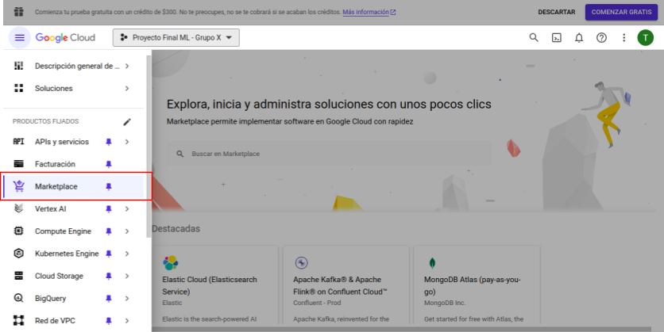

2. Buscar el producto “Deep Learning VM” y hacer click en “Comenzar”.  
  

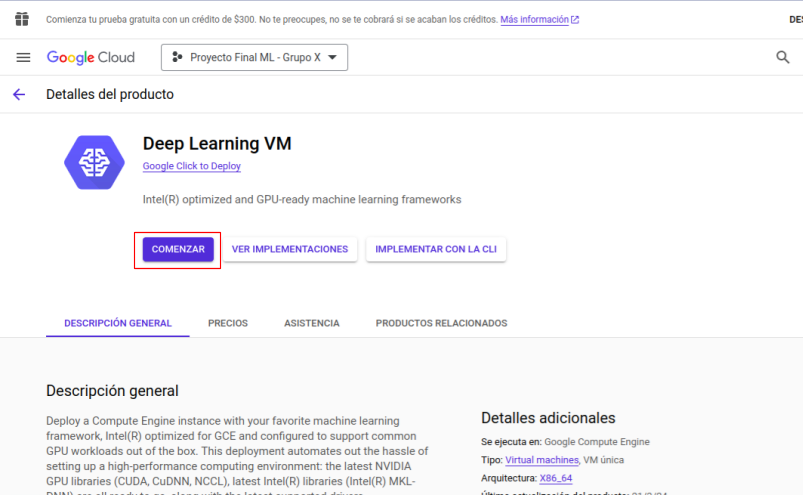

3. Aceptar los Términos y Acuerdos. Se abrirá una ventana emergente, deberá hacer clic en “Implementar”.  
  

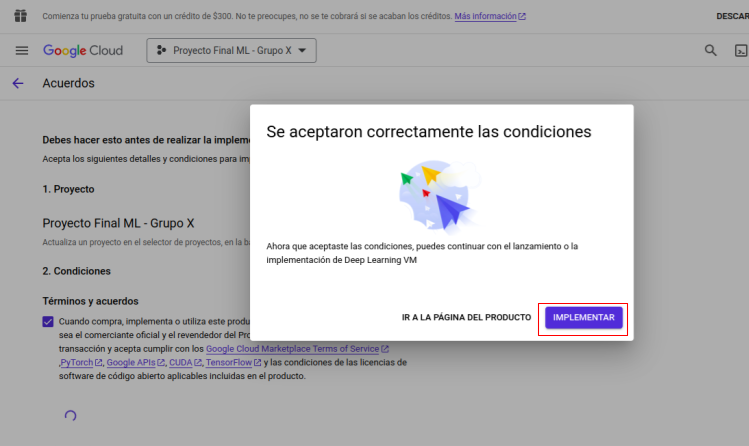

4. Si se indica que se deben habilitar las APIs obligatorias, hacer clic en “Habilitar”.   
  

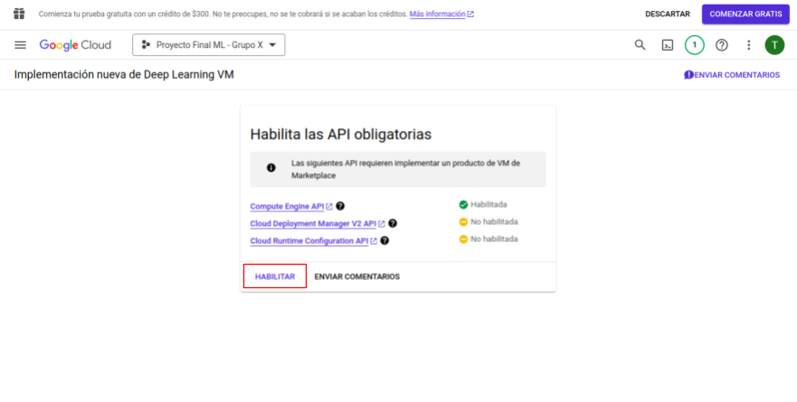

5. Se abrirá una ventana “Implementación nueva de Deep Learning VM”. Pueden elegir la configuración de la VM que deseen, siempre teniendo en cuenta las estimaciones de precios y los recursos disponibles en la zona que están seleccionando.   
  

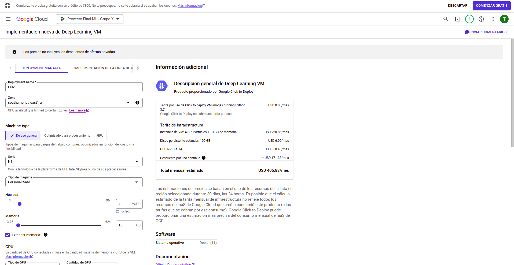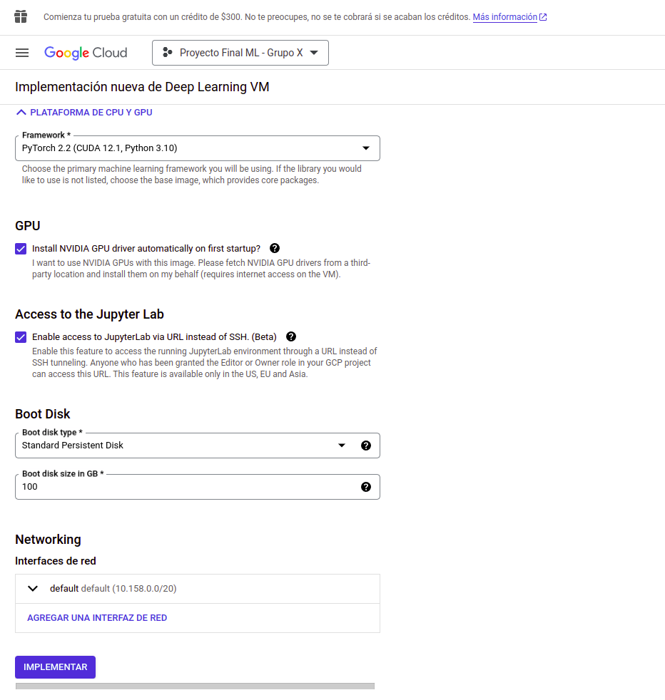

#### Cambiar configuración de instancia de VM ya creada

- Es posible cambiar la cantidad de CPUs, la cantidad de GPUs, la memoria de la CPU y el tipo de GPU después de haber creado tu VM.
- Simplemente debés detener tu instancia e ir a los detalles de tu instancia de VM en Compute Engine &gt; Instancias de VM &gt; \[hacé clic en el nombre de la instancia\].
- Hacé clic en “editar” en la página de tu VM para modificar los ajustes. Finalmente, hacé clic en “Guardar”.

### Configurar Red 

- Una vez finalizado el despliegue de la máquina virtual, deberían observar que está en funcionamiento, indicado por un tic verde en “Estado” en la [página de Compute Engine.](https://www.google.com/url?q=https://console.cloud.google.com/compute&sa=D&source=editors&ust=1718141758335935&usg=AOvVaw0EKHdIlAWJwm4fImSA1vKn)

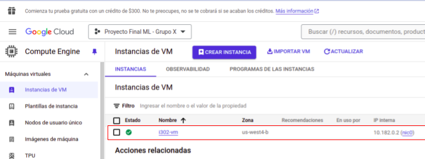

Deberán configurar algunos ajustes más para habilitar acceso remoto a Jupyter Notebook. Para ello:

1. Detener la instancia (seleccionan la instancia y presionan “Detener”). Luego de detenerla, en “Estado” ya no debería aparecer el tic verde.

2. Seleccionar el “Nombre” de la instancia (en el ejemplo, “i302-vm”). Luego, hacer clic en “Editar”.   
  

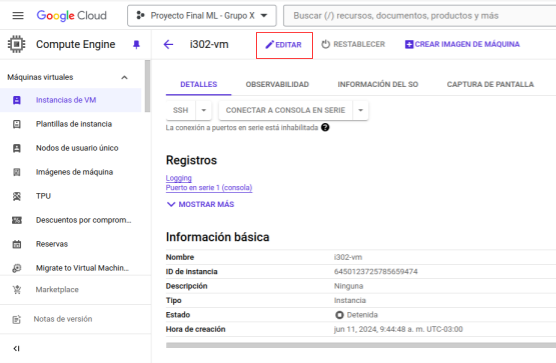

3. Desplazar hacia abajo y tildar las opciones “Allow HTTP traffic” y “Allow HTTPS traffic”. Desplazar hasta el final y hacer clic en el botón “Guardar”.   
  

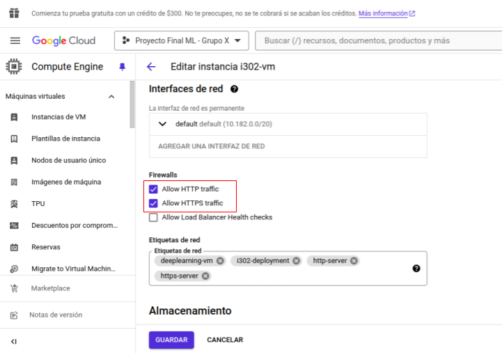

4. Ir a la página de [Políticas de Firewall](https://www.google.com/url?q=https://console.cloud.google.com/networking/firewalls&sa=D&source=editors&ust=1718141758337545&usg=AOvVaw0NTmb9IIHTP-j3FUgpcU-n).
5. Hacer clic en “Crear regla de firewall”.   
  

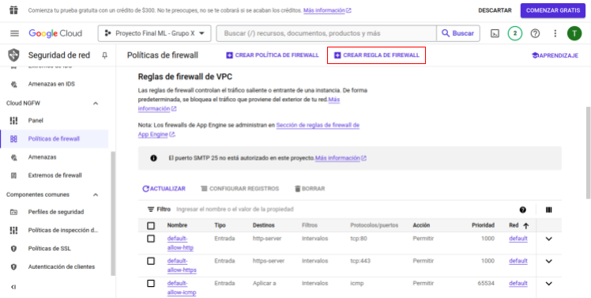

1. Darle un nombre arbitrario, como “i302”.
2. En el campo “Destinos”, seleccionar la opción “Todas las instancias de la red”. 
3. En el campo “Rangos de IPv4 de origen”, ingresar “0.0.0.0/0”.
4. En “Protocolos y puertos”, seleccionar la opción “Protocolos y puertos especificados”. Luego, tildar “TCP” y dentro de “Puertos” ingresar “7000-9000”.
5. Hacer clic en el botón “Crear”.

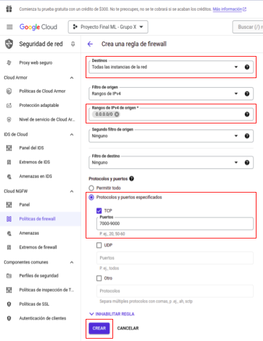

6. Reanudar su instancia en la [página de Compute Engine.](https://www.google.com/url?q=https://console.cloud.google.com/compute&sa=D&source=editors&ust=1718141758338816&usg=AOvVaw0gAJ6izd_tH8399-hKYatL)

#### Obtener una dirección IP estática   

Si querés tener una IP estática para facilitar el acceso, podés cambiar la dirección IP externa de tu instancia de Google Cloud Engine a una estática.  

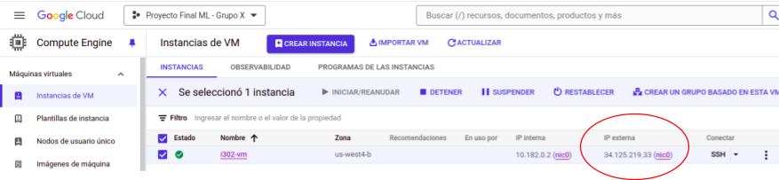

1. Abrir el menú de la izquierda ☰ &gt; Red de VPC &gt; Direcciones IP.

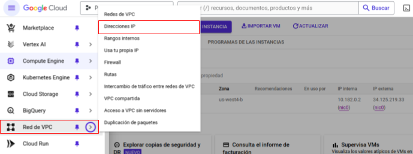

2. En la ventana de “Direcciones IP”, seleccionar “Direcciones IP Externas”.   
  Desplazarse hacia el final de la barra y hacer clic en ⋮  
  Ingresar el nombre que prefiera para su IP estática; en nuestro caso, utilizamos “i302-ip”. Finalmente, hacer clic en “Reservar”.

Esto cambiará el “Tipo” de “Efímera” a “Estática”.   

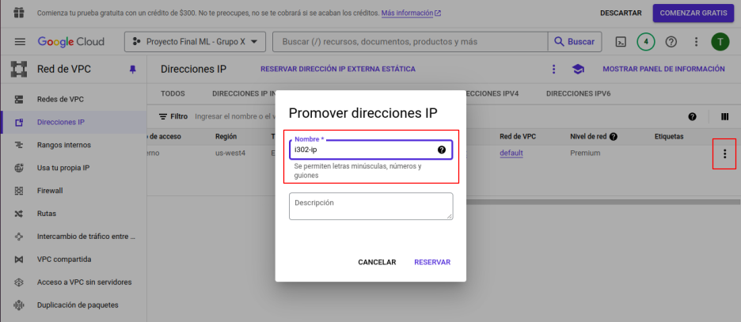

3. Tomar nota de la dirección IP estática (indicada con un círculo en la captura de pantalla abajo). Usamos 34.125.219.33 para este tutorial.  
  

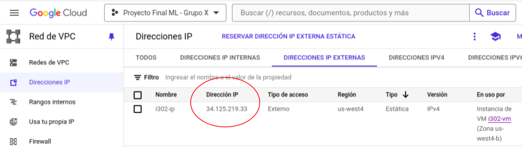

- - - - - -

Acceso a tu nueva VM creada
----------------------------------------------------

Ahora que creaste tu Google Cloud Engine (GCE) virtual, seguramente querrás conectarte a ella desde tu computadora. El resto de este tutorial explica cómo hacerlo usando la línea de comandos.

### Instalar herramientas de línea de comandos de gcloud

- Para acceder a los [comandos de gcloud](https://www.google.com/url?q=https://cloud.google.com/sdk/gcloud/reference&sa=D&source=editors&ust=1718141758341843&usg=AOvVaw0XYnHsW0YStcvAoAA0zfCr) en tu terminal local, instalar el [Google Cloud SDK](https://www.google.com/url?q=https://cloud.google.com/sdk/docs&sa=D&source=editors&ust=1718141758342140&usg=AOvVaw2izJLo1ZhcnxL73bkRyZQc) adecuado para tu plataforma y seguir sus instrucciones.
- Si el comando gcloud no está en la ruta de tu sistema después de la instalación, también podes hacer referencia a él mediante su ruta completa ``/<DIRECTORY-WHERE-GOOGLE-CLOUD-IS-INSTALLED>/bin/gcloud``. Consulta [esta página](https://www.google.com/url?q=https://cloud.google.com/compute/docs/instances/connecting-to-instance&sa=D&source=editors&ust=1718141758342691&usg=AOvVaw0hbfIAudVxSLCYYBPAzXtc) para obtener instrucciones más detalladas.
- Para conectarte por SSH a tu VM, ir a la página de detalles de la instancia de tu VM haciendo clic en su nombre. Una vez que la instancia de la VM está iniciada, hacer clic en la flecha desplegable de SSH y seleccionar “Ver comando de gcloud”.   
  Se debería parecer a: ``gcloud compute ssh --zone "YOUR_VM_ZONE" "<YOUR_VM_NAME>" --project "<YOUR_PROJECT_ID>``"

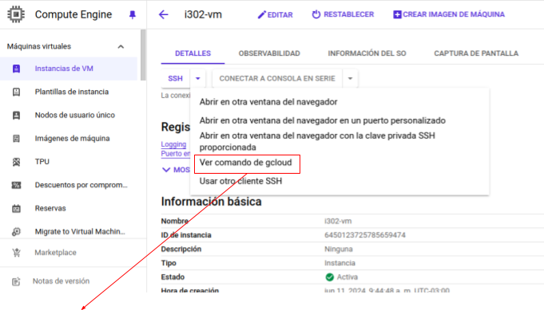

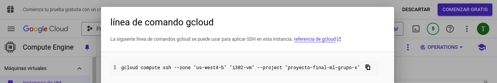

- Ahora deberías poder ejecutar ``nvidia-smi`` y ver la lista de GPUs conectadas y sus estadísticas de uso. También, podés ejecutar ``watch nvidia-smi`` para monitorear el uso de tu GPU en tiempo real.  
  

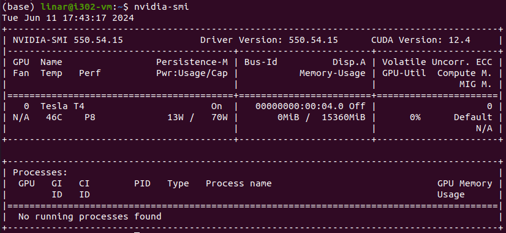

- - - - - -

### 

Desarrollo en Servidor Remoto
------------------------------------------------------

### Usar Jupyter Notebook con Google Compute Engine

- Si deseas usar Jupyter Notebook, te explicamos cómo ejecutar Jupyter Notebook desde tu instancia de GCE y conectarte a él con su navegador local.
- Después de conectarte por SSH a la VM por primera vez, necesitas ejecutar algunos comandos en tu directorio home. Se te pedirá que configures una contraseña para tu Jupyter Notebook. (En este tutorial, elegimos “pass”).  
  

    ``git clone https://github.com/tmonreal/i302-gcloud.git`` 
    
    ``cd i302-gcloud/`` 
    
    ``chmod +x ./setup.sh``
    
    ``./setup.sh``

- Ahora podés ejecutar Jupyter Notebook desde la carpeta con tus archivos del proyecto final usando el comando jupyter notebook.
- El puerto por defecto es 8888 (esto se encuentra especificado en el archivo “jupyter\_notebook\_config.py”).
- Para conectarte a su sesión de Jupyter desde tu computadora personal, primero tenés que verificar la dirección IP externa de tu instancia (recordemos que para este tutorial era [34.125.219.33](https://www.google.com/url?q=http://34.125.219.33/&sa=D&source=editors&ust=1718141758346608&usg=AOvVaw0mLxvWNKb6lTuJrCp04sVp)). Abrir cualquier navegador y visitar [34.125.219.33](https://www.google.com/url?q=http://34.125.219.33/&sa=D&source=editors&ust=1718141758347114&usg=AOvVaw1DKTItuzz8h_uChNrYmZ1b):8888. La contraseña de inicio de sesión es la que configuraste con el script de instalación mencionado anteriormente (Para este tutorial: “pass”).

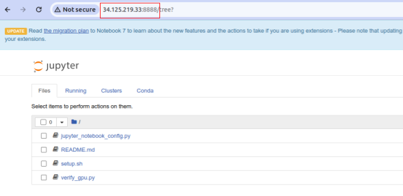  

### Verificación 

- Dentro de la carpeta ``i302-gcloud``, ejecutar ``python verify_gpu.py``.   
  Si tu GPU está conectada y CUDA está correctamente instalado, no deberías ver ningún error.

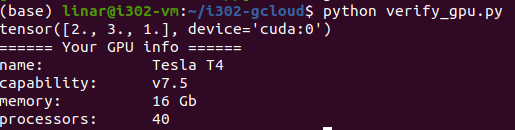

- Si querés usar PyTorch, podés ejecutar  ``python test_torch.py``.   
  Este script te mostrará la versión instalada de PyTorch y luego ejecutará un entrenamiento de prueba usando el dataset MNIST. Deberían ver aproximadamente un 97% de accuracy al final.

Otros consejos
---------------------------------------

- Pueden usar [Tmux](https://www.google.com/url?q=https://linuxize.com/post/getting-started-with-tmux/&sa=D&source=editors&ust=1718141758349072&usg=AOvVaw3IA-HjduzQr-pf6uzU-cj3) para mantener las sesiones de entrenamiento ejecutándose cuando cierran su laptop. Además, si su compañero inicia sesión en la misma cuenta en la instancia de VM, deberían ver la misma pantalla de sesión de tmux en tiempo real.
- Pueden desarrollar su código directamente en el servidor remoto si se sienten cómodos con vim o emacs.
- Pueden desarrollar localmente en su editor de preferencia, hacer push a su branch en Github y hacer pull en el servidor remoto para ejecutar. 
- Además de gcloud compute [scp](https://www.google.com/url?q=https://cloud.google.com/sdk/gcloud/reference/compute/scp&sa=D&source=editors&ust=1718141758349994&usg=AOvVaw3-B4UtTZgNdTW0PONIQY43), otra herramienta que pueden probar es [rsync](https://www.google.com/url?q=https://linuxize.com/post/how-to-use-rsync-for-local-and-remote-data-transfer-and-synchronization/&sa=D&source=editors&ust=1718141758350282&usg=AOvVaw1yGxIr7RyA-C4wXHwOZKkH), que puede sincronizar archivos y carpetas entre su computadora local y el servidor remoto.

### Gran Recordatorio: ¡Detengan sus instancias!

No se olviden de detener su instancia cuando hayan terminado. Podrán reiniciar su instancia y el software descargado seguirá estando disponible. Se les cobrará por hora cuando su instancia esté en funcionamiento. Esto incluye el tiempo de desarrollo de código. Les recomendamos que se informen sobre Google Cloud, lleven un seguimiento regular de sus créditos y no dependan únicamente de este tutorial.

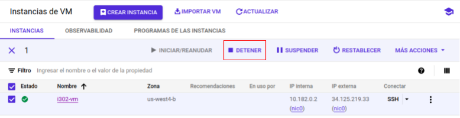

